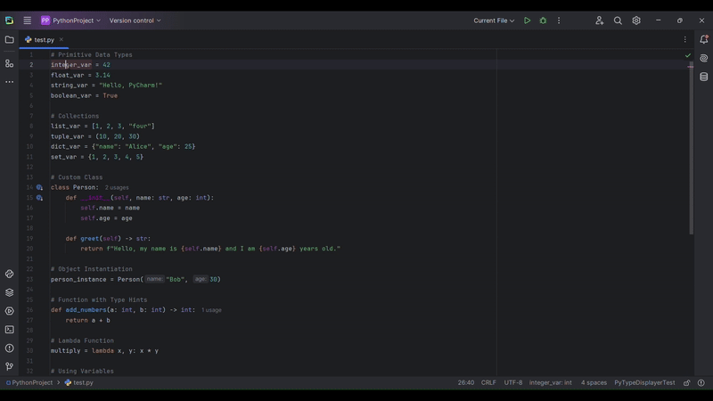

# PyTypeDisplayer

A PyCharm plugin that automatically displays the type of Python variables in the status bar as you move your cursor through your code.

## Features

PyTypeDisplayer enhances your Python development experience by providing real-time type information without requiring explicit annotations. The plugin:

- Shows the inferred type of Python variables in the status bar as you navigate your code
- Works with both explicit type annotations and PyCharm's type inference system
- Updates automatically when you move your cursor to different variables
- Provides detailed type information for various Python data structures
- Integrates seamlessly with the PyCharm interface

## Example

When working with Python code like:

```python
name = "John"
age = 30
users = ["Alice", "Bob", "Charlie"]
coordinates = (10.5, 20.3)
person = {"name": "Sarah", "age": 25}
```

As you move your cursor over each variable, the status bar will automatically display:
```
name: str 
age: int 
users: list 
coordinates: 
tuple person: dict
```



## Usage

After installation:

- The plugin automatically activates for **Python files**.
- Move your **cursor** over any variable in your Python code.
- Look at the **status bar** at the bottom of the IDE to see the variable's type.
- The type information **updates in real-time** as you navigate through your code.

### To enable or disable the status bar widget:
1. **Right-click** on the status bar.
2. Check or uncheck **"Python Type Information"** in the menu.

## Building from Source

### Prerequisites
- **IntelliJ IDEA** or **PyCharm**
- **Java Development Kit (JDK) 17 or newer**
- **Gradle 7.5 or newer**

### Build Steps
1. **Clone this repository**:
    ```bash
    git clone https://github.com/aircode610/PyTypeDisplayer.git
    ```
2. **Navigate to the project directory**:
    ```bash
    cd PyTypeDisplayer
    ```
3. **Build the plugin**:
    ```bash
    ./gradlew buildPlugin
    ```
4. The plugin will be generated in the `build/distributions` directory.


5. **Run the plugin**:
   - You can either **run it using Gradle**:
     ```bash
     ./gradlew runIde
     ```
   - Or **install it in PyCharm manually**:
      1. Open **PyCharm**.
      2. Go to **Settings/Preferences** → **Plugins**.
      3. Click the **gear icon** ⚙ and select **"Install Plugin from Disk..."**.
      4. Select the built **`.zip`** file from `build/distributions/`.
      5. Click **OK → Apply → Restart PyCharm**.